# Assembly e Bibliotecas de Software
## Problema II - TEC499 - MI Sistemas Digitais - 2024.2 

Professor: Wild Freitas da Silva Santos

Grupo: [Guilherme Ferreira Rocha Lopes](https://github.com/GuilhermeFRLopes), [Thiago Ramon Santos de Jesus](https://github.com/lithiago) e [Ícaro de Souza Gonçalves](https://github.com/icarosg)

## Seções

1. [Introdução](#introdução)
2. [Requisitos do Projeto](#requisitos-do-projeto)
3. [Objetivos](#objetivos)
4. [Descrição das Ferramentas Utilizadas](#descrição-das-ferramentas-utilizadas)
5. [Metodologia](#metodologia)
6. [Dificuldades](#dificuldades)
7. [Resultados e Conclusão](#execução-do-jogo)
8. [Referências](#referencias)

## Introdução

Este documento descreve em detalhes o desenvolvimento de um jogo de quebra-cabeça  conhecido como Tetris. Utiliza a linguagem C para implementação lógica e Assembly LEGV7 para construção de uma biblioteca para uso do processador gráfico presente na placa de desenvolvimento modelo [DE1-SoC da terasIC](https://www.terasic.com.tw/cgi-bin/page/archive.pl?Language=English&CategoryNo=167&No=836#contents).

O projeto representa uma evolução de um trabalho anterior, em que as funcionalidades gráficas eram realizadas pela FPGA. Posto isso, este relatório apresenta o desenvolvimento de uma biblioteca com funções gráficas, a qual abstrai o projeto desenvolvido pelo discente Gabriel Sá Barreto. Em suas atividades de Iniciação Científica e trabalho de conclusão de curso, o estudante projetou e implementou um processador gráfico que permite mover e controlar elementos em um monitor VGA. Durante esse desenvolvimento, o aluno utilizou como unidade principal de processamento o NIOS II, embarcado na mesma FPGA que o processador gráfico.

## Requisitos do Projeto
O problema proposto deve ser desenvolvido no Kit de desenvolvimento DE1-Soc atendendo as seguintes requisições:

1. O código da biblioteca deve ser escrito em linguagem aseembly;
2. A biblioteca deve conter as funções essenciais para que seja possível implementar a parte gráfica do jogo usando o Processador Gráfico.

## Objetivos
- Aplicar conhecimentos de interação hardware-software;
-  Compreender o mapeamento de memória em uma arquitetura ARM;
-  Utilizar a interface de conexão entre HPS e FPGA da DE1-SoC;
-  Programar em assembly para um processador com arquitetura ARM;
-  Entender políticas de gerenciamento de sistema operacional Linux em arquitetura ARM;
 - Compreender os princípios básicos da arquitetura da plataforma DE1-SoC.

## Descrição das Ferramentas Utilizadas
- Placa de Desenvolvimento: O projeto em questão faz uso de hardware específico para seu desenvolvimento, sendo empregada uma placa de desenvolvimento DE1-SoC da terasIC . Ela é ideal para diversos projetos de prototipagem e desenvolvimento de sistemas embarcados. Ela combina um FPGA Cyclone V SoC da Intel com um processador dual-core ARM Cortex-A9, oferecendo uma plataforma completa e flexível para implementação de hardware e software. Seu acesso para a execução do jogo é feito através da conexão via SSH (ethernet) no terminal de um computador.
- Visual Studio Code: é um editor de código-fonte gratuito e de código aberto desenvolvido pela Microsoft. É multiplataforma, altamente extensível, oferece integração com Git, suporte a várias linguagens de programação, ferramentas de depuração integradas e um terminal incorporado.
- Makefile: Um Makefile é um arquivo de configuração utilizado pela ferramenta make, um utilitário de automação de compilação em sistemas Unix e Linux. Ele descreve como compilar e montar um projeto, especialmente aqueles que envolvem múltiplos arquivos de código-fonte e etapas de compilação complexas
- Github: Uma plataforma de hospedagem de código-fonte e colaboração que utiliza o sistema de controle de versão Git. Ele permite que desenvolvedores gerenciem, compartilhem e trabalhem colaborativamente em projetos de software de forma organizada e eficiente.
- Linguagem C: Linguagem de programação em alto nível usada para implementação da lógica do Tetris
- Assembly LegV7: O Assembly LEGv7 é uma linguagem de montagem (assembly) para a arquitetura ARM especificamente baseada no conjunto de instruções ARMv7
- Bibliotecas do Kernel: Para auxiliar no desenvolvimento do código em C do Jogo foram utilizadas as seguintes bibliotecas: Stdio, stdlib, stdint, time, sys/mman, fcntl, Stdbool e unistd.
1. As bibliotecas Stdio stdlib, stdint, time, Stdbool fornecem funções para diversas tarefas em C, como manipulação de entrada/saída, operações de baixo nível em sistemas Unix-like e tipos booleanos.
2. sys/mman: Essa biblioteca fornece funções para gerenciamento de memória, especialmente para mapeamento de arquivos ou dispositivos na memória. 
3. fcntl: Essa biblioteca contém definições relacionadas a arquivos e controladores de entrada/saída.

## Metodologia
Para a realização deste projeto, decidiu-se reaproveitar elementos já desenvolvidos na primeira versão do jogo. Foram mantidas as implementações das funções que constituem a lógica central do jogo, bem como o mapeamento de memória do dispositivo ADXL345, o acelerômetro. Apenas as funções relacionadas ao módulo da FPGA foram excluídas, uma vez que não seriam utilizadas na nova abordagem.

Para a implementação atual, tornou-se necessário o aprofundamento em conceitos sobre a arquitetura do processador gráfico, bem como o entendimento do desenvolvimento de código em linguagem assembly para a arquitetura ARM. Isso permitiu uma integração mais eficaz com os recursos de hardware e a otimização do desempenho da aplicação.

- **Mapeamento de Memória em Assembly**: O mapeamento de memória foi essencial para viabilizar o controle preciso no envio de instruções e comandos à unidade de processamento gráfico (GPU). Esse processo foi implementado através do uso de Syscalls (chamadas de sistema), que permitem que o código Assembly interaja diretamente com o sistema operacional para acessar serviços específicos, como o mapeamento de dispositivos de memória e arquivos. Por meio dessas chamadas, o Assembly pode manipular endereços virtuais, garantindo que a GPU receba os dados de controle de forma eficaz e eficiente.
- **Arquitetura do Processador Gráfico**:
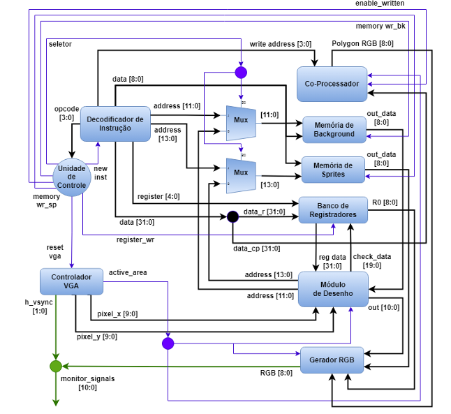 Figura 1: Arquitetura do Processador Gráfico

A figura 1, mostra o fluxo de execução do processador gráfico, esse pode ser descrito da seguinte forma:

1. A Unidade de Controle é o ponto de partida do fluxo de dados, responsável por orquestrar o processamento de instruções e comandar a operação dos demais componentes. Ela recebe o código de operação (opcode), que indica a instrução a ser executada, e gera diversos sinais de controle, como memory_wr_sp, reset_vga e new inst, que indicam o início de uma nova instrução. Esta unidade funciona como uma máquina de estados, gerenciando as transições e o comportamento do sistema.

2. Em seguida, o Decodificador de Instrução recebe a instrução da Unidade de Controle e a traduz em operações específicas. Ele direciona os sinais para componentes como os multiplexadores, o Banco de Registradores e as memórias, determinando qual ação será realizada com base na instrução recebida.

3. O Banco de Registradores desempenha o papel de armazenar dados temporários durante a execução das instruções. Ele recebe o sinal register_wr, que habilita a escrita, e é alimentado com o dado a ser armazenado, além do número do registrador de destino. Ele fornece dados de saída, como R0, que se conectam ao Módulo de Desenho e a outros componentes.

4. O Módulo de Desenho é responsável por processar e renderizar os elementos gráficos na tela. Ele utiliza dados provenientes do Banco de Registradores, da Memória de Background (dados de fundo) e da Memória de Sprites (imagens na tela) para compor os gráficos que serão exibidos.

5. A Memória de Background armazena os dados de fundo da tela e compartilha sua saída out_data com o Módulo de Desenho, permitindo que este module acesse o conteúdo de fundo. Similarmente, a Memória de Sprites armazena dados gráficos de sprites (elementos visuais móveis ou fixos) e se conecta ao Gerador RGB, que processa esses dados para a exibição.

6. O Co-Processador atua como uma unidade de suporte para operações auxiliares, recebendo sinais de várias partes do circuito e sendo o responsável pela geração de polígonos no monitor. Ele realiza operações que complementam a execução da Unidade de Controle principal, aliviando a carga de processamento dessa unidade.

7. O Controlador VGA é encarregado de gerar e sincronizar o sinal VGA para a tela. Ele recebe o sinal reset_vga para reinicializar, e gera os sinais monitor_signals para o monitor, além das coordenadas dos pixels (pixel_x e pixel_y), que determinam a posição dos elementos gráficos.

8. O Gerador RGB converte os dados gráficos em sinais RGB apropriados para serem enviados ao monitor. Ele recebe dados de múltiplos módulos, incluindo o Módulo de Desenho e as memórias, e produz os sinais RGB que representam as cores dos pixels exibidos.

9. Por fim, os Multiplexadores (Mux) têm a função de selecionar entre várias entradas com base nos sinais de controle, direcionando os dados apropriados para cada saída. Eles recebem diferentes sinais de entrada, como data, address, e outros, e entregam as saídas corretas aos componentes conectados.

- Acesso ao Procesador Gráfico: O acesso é feito utilizando o canal Lightweight HPS2FPGA, que faciliata a comunicação entre o HPS (Hard Processor System) e a FPGA. Esse canal tem um endereço base de xff200000, o mapeamento é descrito em [Mapeamento de Memória em Assembly](#mapeamento). Combinado com valores constantes definidos na figura 2, esse mapeamento permite que instruções específicas sejam enviadas para a GPU. Utilizando o mapeamento de memória descrito anteirormente, somado com os valores de offset, o Assembly consegue mapear as instruções no formato necessário para que a GPU as interpetre e execute.
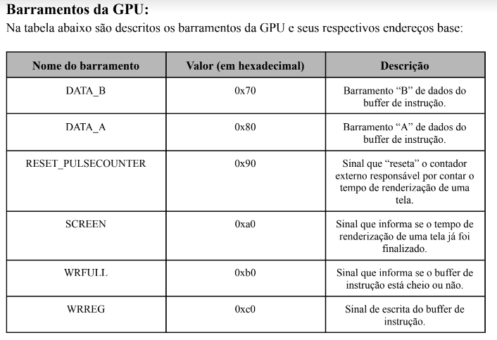Figura 2: Valores de Offset

- Tipos de Instruções:

    - Instrução WBR (Escrita no Banco de Registradores): Essa instrução é responsável por configurar os registradores que armazenam as informações dos sprites e a cor base do background. A cor base é armazenada no primeiro registrador do Banco, a estrutura dessa instrução pode ser vista na Figura 3. A figura 4,  mostra a configuração de uma sprite, a escolha do sprite é feita através do campo offset, que indica a localização do sprite na memória. O campo registrador é utilizado para definier em qual registrador o sprite será armazenado, as coodernadas X e Y indicam a posição e o campo SP serve como um ativador.
    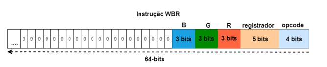 Figura 3: Uso da Instrução WBR para modificação da cor do background
    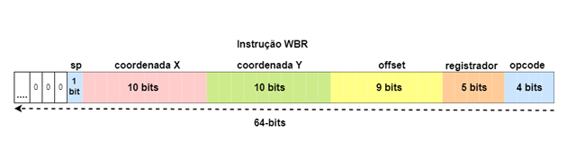 Figura 4:  Uso da Instruções WBR para configurar um sprite.

    - Instrução WSM (Escrita na Memóoria de Sprites): Essa instrução armazena ou modifica o conteúdo presente na Memória de Sprites. O campo opcode para essa instrução é configurado como 0001. O campo de endereço de memória especifica o local na memória que será alterado, e os campos R, G e B definem as novas componentes RGB para esse local.
    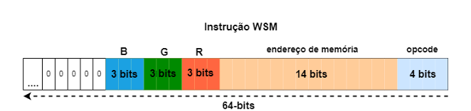 Figura 5: Instrução WSM

    - Instrução WBM (Escrita na Memória de Background ): Essa instrução armazena ou altera o conteúdo da Memória de Background, configurando valores RGB para preencher áreas específicas do background. A estrutura é semelhante à de WSM, mas o campo de endereço de memória tem 12 bits. O opcode para WBM é configurado como 0010. A área de background é dividida em blocos de 8x8 pixels, e cada endereço de memória corresponde a um desses blocos. Se o endereço de memória de um bloco de background for preenchido com o valor 510 (ou 0b11111111), o sistema interpreta esse bloco como desativado. Isso significa que o bloco correspondente não exibirá uma cor específica. Em vez disso, ele será preenchido com a cor base do background, um polígono, ou um sprite, dependendo da sobreposição e das coordenadas desses elementos em relação ao bloco.

    - Instrução DP (Definição de Poligono): Essa instrução modifica o conteúdo da Memória de Instrução do Co-Processador para definir os dados de um polígono a ser renderizado. O opcode para DP é 0011. Os campos ref point X e ref point Y especificam as coordenadas do ponto de referência do polígono, o campo tamanho define a dimensão do polígono, e as componentes RGB especificam sua cor. Além disso, há um bit de forma que indica se o polígono é um quadrado (0) ou um triângulo (1).
    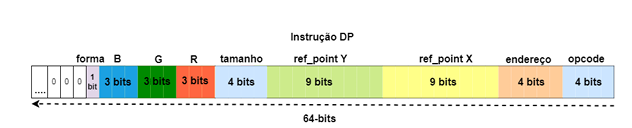 Figura 6: Instrução DP

    - Barramentos dataA e dataB: Esses barramentos tem como responsabiliade criar a comunicação entre a CPU e a GPU, transportando instruções de controle e os dados de configuração para o processador gráfico de forma organizada. Outra finalidade é a distribuição das instruções do processador gráfico. Como as instruções já citadas, possuem 64 bits, é preciso contornar isso dividindo essas instruções nesses dois barramentos cada um com 32 bits.
    
        - dataA: Esse barramento é utilizado principalmente para transportar opcodes e endereços de memória. Ele indica qual instrução será executada pelo processador gráfico e qual posição de memória (como a posição na Memória de Sprites ou no Banco de Registradores) será acessada ou alterada. Isso é essencial para a organização e sequenciamento das instruções.
        - dataB:  Esse barramento é usado para transportar os dados específicos da operação, como os valores RGB para cores ou as coordenadas x e y dos sprites e polígonos. Isso permite que o processador gráfico receba diretamente as informações necessárias para desenhar ou modificar elementos na tela.
        
        Abaixo segue a linha de implementação dos barramentos dividindo cada instrução:
        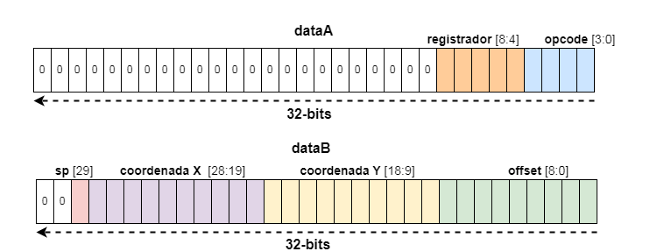 Figura 7: dataA e dataB para uma instrução WBR que define um Sprite 
        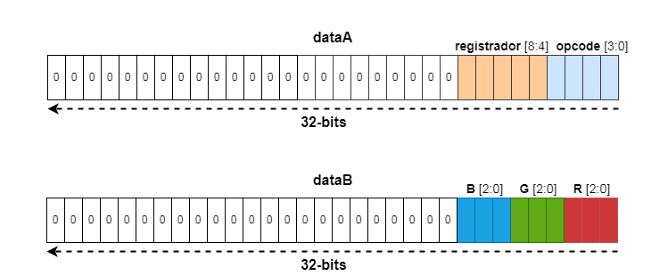 Figura 8: dataA e dataB para uma instrução WBR que define o background
        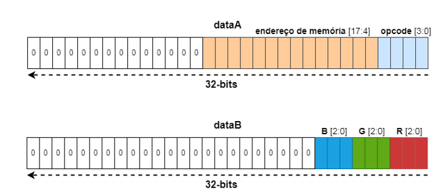 Figura 9: dataA e dataB para uma instrução WSM
        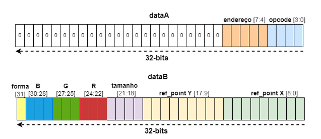 Figura 10: dataA e dataB para uma instrução DP
- Construção da Biblioteca do Processsador Gráfico: A implementação gráfica do sistema conta com uma biblioteca dedicada ao processador gráfico, composta por diversas funções essenciais para a construção e manipulação dos elementos visuais do jogo. Dentre essas funções, algumas são fundamentais para definir e atualizar o cenário e os sprites. As funções principais incluem:

    - set_background_block: Configura blocos do background com cores específicas.
    - send_instruction: Envia instruções ao processador gráfico para realizar as operações desejadas.
    - isFull: Verifica se as filas FIFO, responsáveis por armazenar as instruções, estão cheias. 
    
    Além dessas, também foram implementadas outras funções para controle detalhado:

    - set_sprite: Define as propriedades e a posição de um sprite na tela.
    - set_background_color: Configura a cor base do background.
    - set_polygon: Define os parâmetros e o desenho de polígonos, como quadrados e triângulos, que podem ser exibidos junto ao background e aos sprites.

    Também em nível de Assembly, a biblioteca gráfica inclui funções específicas para mapeamento e gerenciamento de memória:

    - createMappingMemory: Inicializa o mapeamento de memória necessário para acessar as instruções e os elementos gráficos.
    - closeMappingMemory: Finaliza e libera o mapeamento de memória.
    - open_button: Função para configurar o mapeamento e o controle de botões de entrada.

## Dificuldades
No primeiro passo, foi estabelecida a implementação do mapeamento de memória em Assembly, tarefa que demandou um tempo considerável devido à dificuldade de encontrar uma solução adequada. Essa adversidade foi superada com o uso do conceito de syscalls, que permitiu a chamada de módulos prontos do Linux em operações de baixo nível. A documentação presente em [1] forneceu o código das syscall para as funções, ***open(), mmap2() e close().***

Adicionalmente, o uso de FIFOs não foi considerado de imediato. Por essa razão, surgiram problemas com o envio de instruções, pois, sem uma verificação prévia de capacidade, as instruções eram perdidas quando a FIFO estava cheia. Esse problema também foi solucianado assim que a checagem passou a ser feita.

## Resultados e Conclusão
O projeto alcançou todos os objetivos e requisitos estabelecidos, possuindo uma biblioteca para um processador gráfico funcional, pertimindo a abstração para que o jogo Tetris pudesse ser implementado. A compreensão sobre, conceitos de arquitetura de computadores foi fundamental para a compreensão da arquitetura ArmV7 e suas instruções, conceitos de Sistemas Operacionais, sobre paginação, endereço físico e virtual também foram fundamentais para a conclusão desse projeto.

O uso do código assembly permitiu uma melhor manipulação dos componentes gráficos configurando uma evolução substancial ao Tetris feito anteriormente.

    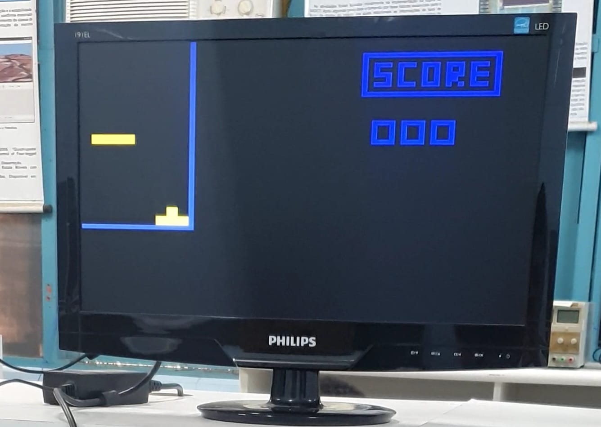
    
Figura 11: Jogo em funcionamento.

   
    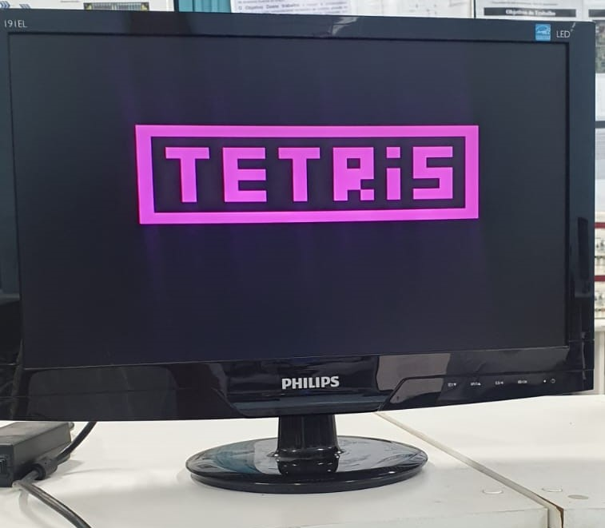
    
Figura 12: Tela Inicial.

  
    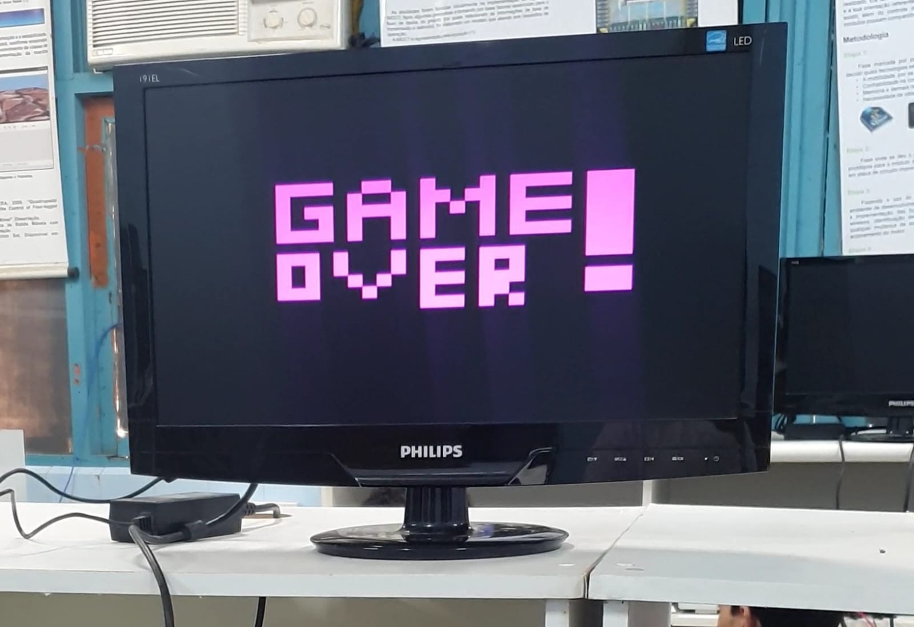
    
Figura 13: Tela de Game Over do jogo.

  
    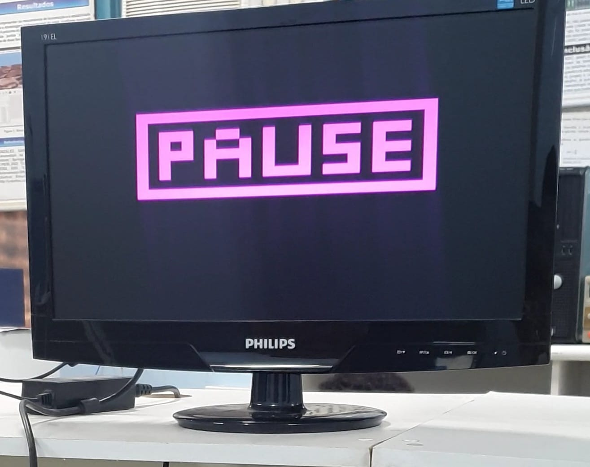
    
Figura 14: Tela de Pause do jogo.

  
    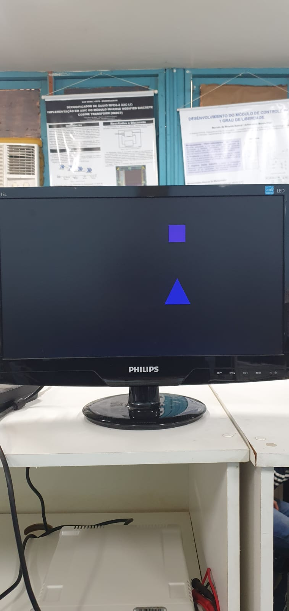
    
Figura 15: Tela com Poligonos.

  
    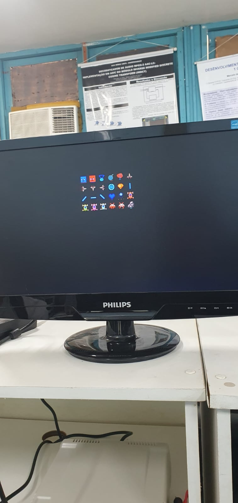
    
Figura 16: Tela com Sprites.

## Referências
[1] Chromium OS Docs, "Syscalls." Accessed Nov. 8, 2024. [Online]. Available: https://chromium.googlesource.com/chromiumos/docs/+/master/constants/syscalls.md

