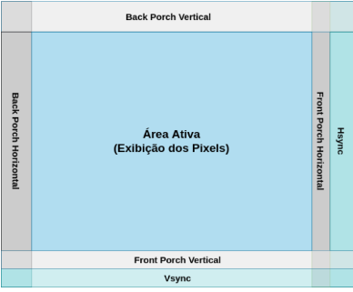

## Conceitos Fundamentais para o desenvolvimento da arquitetura

### VGA CONTROLE DOS SINAIS PARA GERAÇÃO DE VÍDEO: 
Para o controle e geração desses sinais um controlador de vídeo é necessário. O sinal de sincronismo horizontal (hsync) especifica o tempo requerido para percorrer uma linha do monitor. Ele é ativado em nível lógico 0 e inidica que uma linha foi finalizada e que a próxima linha será iniciada. O sinal de sincronimso vertical (vsync) controla o tempo necessário para percorrer toda a tela. Ele é ativo em nível lógico 0 e indica que um Frame.

- Área Ativa: Corresponde ao espaço de exibição dos pixels na tela.
- Front Porch e Back Porch: Corresponde aos tempos de esepera que devem ser implementados para delimitar a região ativa. Esses tempos dependem da resolução e frequência da atualização da tela.

## Modelagem e Organização da Arquitetura

  1. Inicialização das memórias: O processo de renderização começa com a inicialização de duas memórias responsáveis por armazenar os bits de cores RGB dos sprites e do background da tela.
  2. Impressão dos elementos da tela: O padrão gráfico escolhido é o VGA, com resolução de 640x480 pixels. A varredura da tela é realizada da esquerda para a direita e de cima para baixo. Após a varredura completa da área ativa, os sprites são atualizados com base nas novas definições.
  3. Armazenamento dos sprites: As informações dos sprites são armazenadas diretamente no hardware. As atualizações são feitas enviando comandos ao módulo gráfico, que é responsável por gerenciar o processo de renderização.
  4. Estrutura da arquitetura: A arquitetura é composta por um processador de propósito geral (Nios II), duas filas FIFO (First In First Out), uma PLL (Phase Locked Loop) e um processador gráfico dedicado.
  5. Processador geral (Nios II): O Nios II é o processador de propósito geral utilizado para executar o código do jogo. Ele controla a lógica do jogo em linguagem C.
  6. Saídas do processador gráfico: O processador gráfico gera os sinais de sincronização horizontal (hsync) e vertical (vsync), que são necessários para o monitor VGA.
  7. Frequências de clock distintas: O Nios II e o processador gráfico operam com frequências de clock e controle diferentes. As FIFOs atuam como dispositivos intermediários, facilitando a comunicação entre eles.
  8. PLL: A PLL (Phase Locked Loop) é responsável por gerar as frequências de clock adequadas para o funcionamento correto dos diferentes módulos da arquitetura.
  9. Armazenamento das instruções nas FIFOs: O Nios II armazena nas FIFOs as instruções que o processador gráfico deve executar, como as operações de renderização e controle de sprites.
  10. Módulo Gerador de Pulso: O gerador de pulso sincroniza a escrita nas FIFOs. Quando um pulso de escrita é gerado, os dados presentes nos barramentos dataA e dataB são armazenados nas FIFOs.
  11. Capacidade das FIFOs: Cada FIFO pode armazenar até 16 palavras (words) de 32 bits. Quando o sinal wrfull está em nível lógico alto, isso indica que a FIFO atingiu sua capacidade máxima e está cheia.
  12. Independência do Processador Gráfico: O processo de renderização dos sprites é independente do Nios II. Uma vez que as instruções são passadas ao processador gráfico via FIFOs, ele gerencia toda a atualização da tela sem a necessidade de intervenção contínua do processador geral (Nios II). Isso permite que o Nios II se concentre apenas na lógica do jogo e em enviar comandos esporádicos, enquanto o processador gráfico lida com o desenho e a atualização da tela.
  13. Hierarquia de Funções: No fluxo da arquitetura, há uma separação clara entre as funções de hardware e software. O Nios II manipula a lógica do jogo e transmite as coordenadas e atualizações dos sprites, enquanto o processador gráfico é responsável pela execução dessas instruções no nível de hardware, como movimentação dos sprites e alteração do background.
  14. Sincronização e Comunicação: A comunicação entre o Nios II e o processador gráfico é feita por meio de duas FIFOs que permitem a troca de dados de maneira síncrona, garantindo que as instruções não sejam perdidas ou duplicadas. Essa estrutura de comunicação baseada em FIFOs assegura que as instruções sejam executadas em ordem e em intervalos de tempo apropriados.
## Arquitetura do Processador Gráfico

  1. Unidade de Controle: 
  - Consiste em uma máquina de estados que gerencia todo o processo de leitura, decodificação e execução das instruções enviadas pelo processador Nios II.
  - Ela organiza as operações de renderização, garantindo que cada instrução seja processada em ordem e no momento correto.
  - A Unidade de Controle também coordena o acesso ao Banco de Registradores e às memórias de sprites e background, distribuindo as instruções aos módulos apropriados.
  2. Banco de Registradores:
  - Armazena temporariamente informações como coordenadas, offsets de memória e um bit de ativação, que são associados a cada sprite.
  - Cada registrador contém os dados necessários para desenhar e controlar a exibição de um sprite na tela. Esses dados incluem a posição do sprite (coordenadas X e Y), a cor, o offset no mapa de memória, e se o sprite está ativado ou não.      
  3. Capacidade de 32 Registradores:
  - Existem 32 registradores no total. O primeiro registrador é reservado exclusivamente para armazenar a cor de fundo (background) da tela, enquanto os outros 31 são utilizados para armazenar os dados dos sprites.
  - Isso permite que até 31 sprites sejam gerenciados simultaneamente pelo processador gráfico, o que é suficiente para jogos 2D de complexidade moderada.
  4. Módulo de Desenho: 
  - O Módulo de Desenho é responsável por controlar a renderização dos sprites e do background no monitor VGA.
  - Ele gerencia o desenho dos pixels em cada ciclo de varredura da tela, determinando quais sprites ou partes do background devem ser exibidos em cada coordenada da tela.
  - Além disso, o módulo é capaz de lidar com colisões de sprites e sobreposições, garantindo que o desenho na tela siga a lógica correta. 
  5. Controlador VGA: 
  - Gera os sinais de sincronização horizontal (h_sync) e vertical (v_sync), necessários para controlar o tempo e a estrutura da varredura de vídeo no monitor VGA.
  - Além disso, o Controlador VGA fornece as coordenadas X e Y que representam a posição atual do pixel sendo desenhado na tela. Essas coordenadas são fundamentais para determinar onde cada sprite ou parte do background será renderizado.
  6. Memória de Sprites:
  - Uma memória dedicada de 12.800 palavras, onde cada palavra tem 9 bits (3 bits para cada canal de cor RGB). Isso permite armazenar até 32 sprites diferentes com 20x20 pixels cada.
  - Cada sprite é armazenado em uma posição específica na memória e suas informações (coordenadas, cor, etc.) são associadas ao Banco de Registradores para controle durante o processo de renderização.
  7. Memória de Background:
  - Esta memória armazena dados do background, permitindo a alteração de pequenas partes da tela de forma eficiente.
  - Sua capacidade é de 4.800 palavras de 9 bits, o que permite modificar áreas do background sem precisar redesenhar toda a tela. O background é dividido em blocos de 8x8 pixels, o que facilita a organização e atualização da tela.
  8. Co-Processador de Polígonos:
  - Responsável pela criação e renderização de polígonos (como quadrados e triângulos) que compõem a interface gráfica do jogo
  - Trabalha com uma lógica de Análise de Colinearidade para determinar os pontos que pertencem ao interior de cada polígono.
  - O co-processador é executado em paralelo com o processador gráfico principal e é otimizado para calcular e desenhar polígonos em tempo real, utilizando pipelines para processar múltiplas instruções simultaneamente.
  9. Pipeline de Processamento:
  - O processador gráfico utiliza uma arquitetura de pipeline para otimizar o desempenho, permitindo que várias etapas do processo de renderização ocorram em paralelo.
  - Isso é especialmente útil para a renderização de polígonos e sprites em jogos 2D, garantindo que o processador gráfico possa operar em alta velocidade sem afetar o desempenho do sistema.
  10. Memória de Pixels:
  - Armazena temporariamente os valores RGB dos pixels a serem desenhados no próximo ciclo de varredura da tela.
  - Funciona em sincronia com o controlador VGA, garantindo que as informações dos sprites e polígonos sejam exibidas corretamente a cada frame.
  - Essa memória é essencial para a operação em tempo real, pois permite que o processador gráfico atualize a tela continuamente enquanto calcula novos frames.
  11. Módulo Comparador:
  - Este módulo resolve problemas de sobreposição de sprites e polígonos. Ele compara as informações de vários objetos gráficos e decide qual deve ser exibido com base em uma prioridade predefinida.
  - Isso é especialmente importante quando vários objetos ocupam a mesma área da tela, evitando conflitos visuais durante a renderização.
  12. Gerador RGB:
  - Este módulo combina os valores de cor RGB dos sprites, polígonos e background, determinando a cor final que será desenhada em cada pixel da tela.
  - O gerador RGB prioriza a renderização dos sprites sobre os polígonos e o background, garantindo que os objetos em primeiro plano sejam corretamente exibidos.
## Instruções no Processador Gráfico
   
   
   
  1. WBR (Escrita no Banco de Registradores):
     - Configura os registradores que armazenam as informações dos sprites e a cor base do background.
     - A cor do background é armazenada no primeiro registrador, enquanto as informações dos sprites são armazenadas em registradores específicos com coordenadas X e Y, offset de memória e um bit de ativação/desativação
  2. WSM (Escrita na Memória de Sprites):
     - Armazena ou modifica o conteúdo da memória de sprites.
     - Define as componentes RGB dos sprites e seu local de armazenamento na memória​
  3. WBM (Escrita na Memória de Background):
     - Similar ao WSM, mas com foco na modificação do background.
     - Os valores RGB são configurados para preencher blocos de 8x8 pixels no background.
  4. DP (Definição de Poligonos):
     - Utilizada para configurar a memória de instrução do co-processador gráfico.
     - Define os dados do polígono, como o ponto de referência (X, Y), tamanho, cor RGB, e forma (quadrado ou triângulo).
     - O valor do opcode é configurado como 0011, com diferentes campos para controle e configuração dos polígonos.
